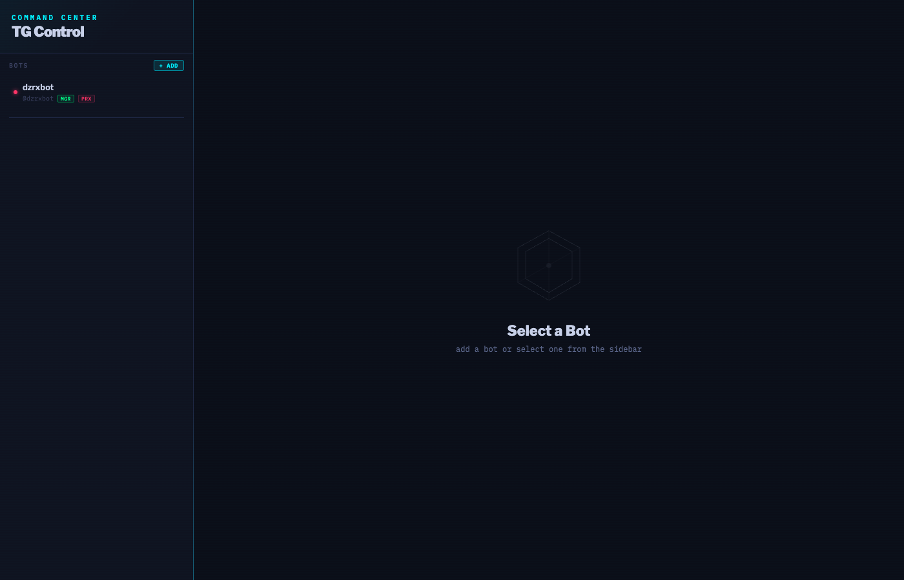
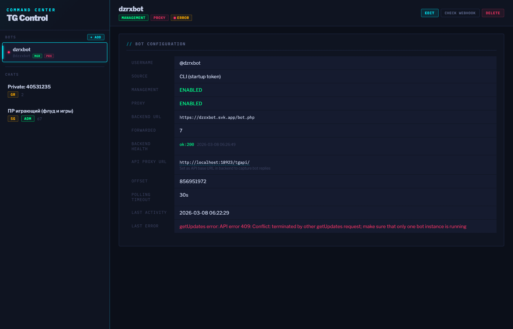
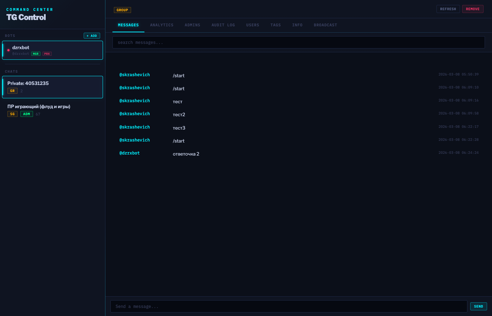
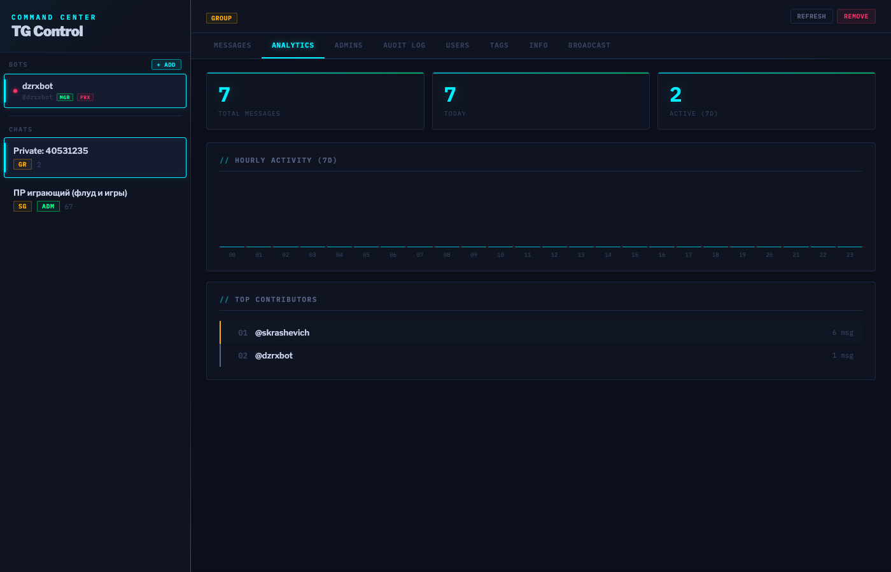
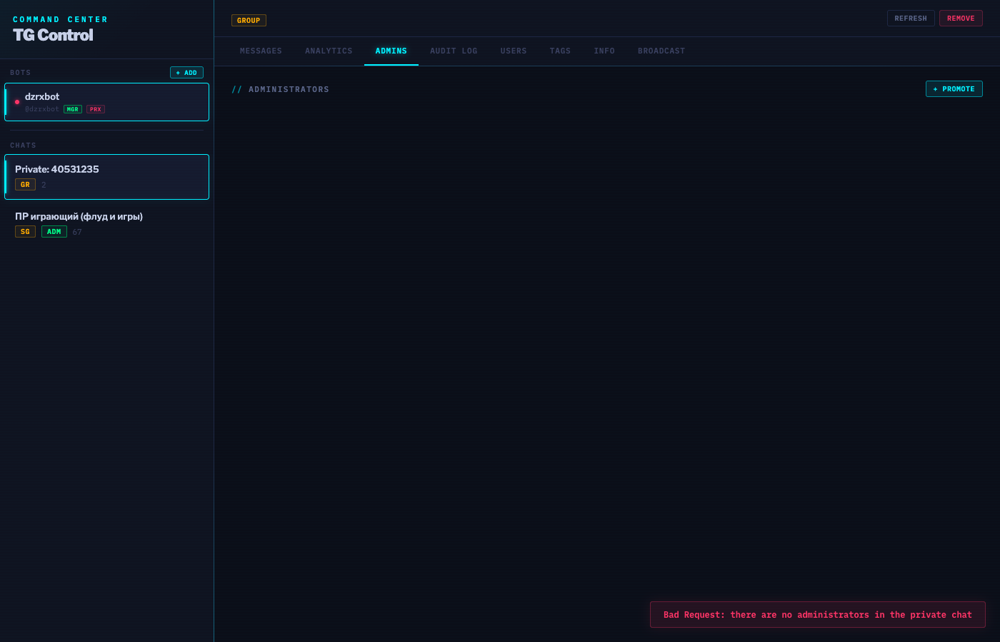
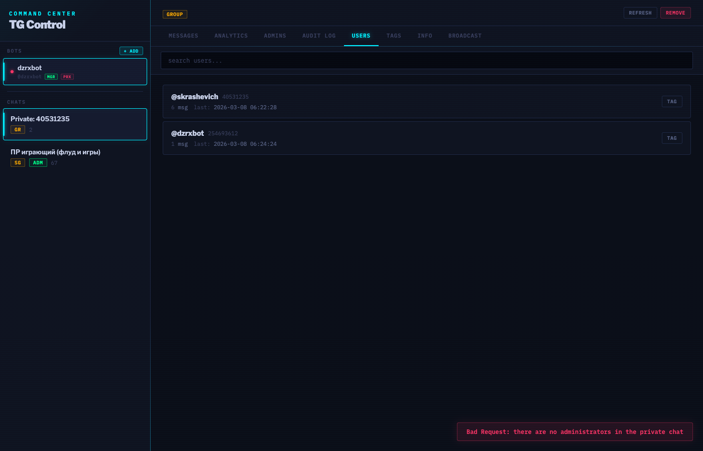
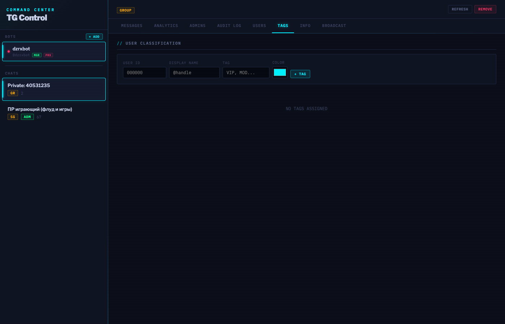
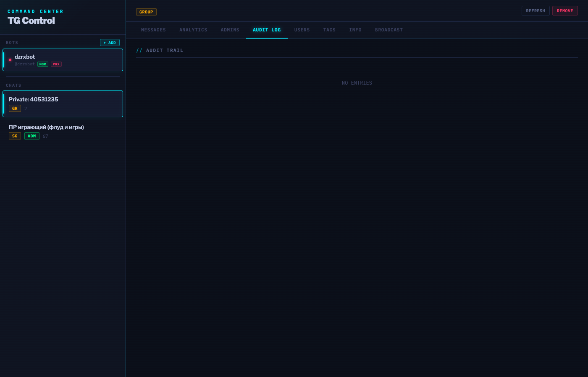
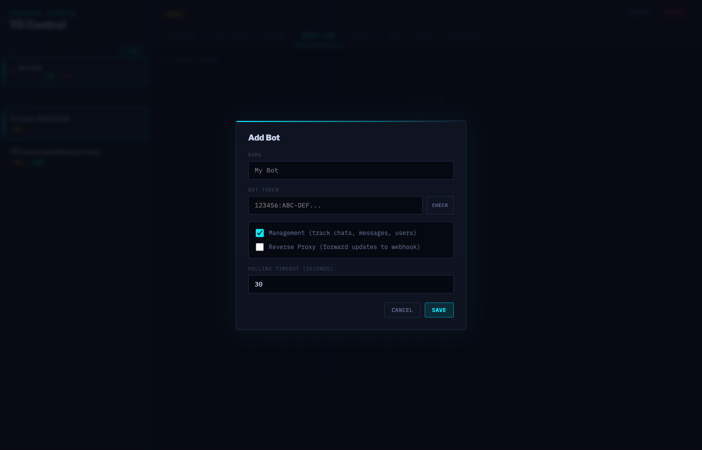

# botmux

Web-based command center for managing Telegram groups and channels via Bot API, with built-in reverse proxy for legacy webhook bots.

Give it a bot token — it discovers which chats the bot is in, whether it has admin privileges, and provides a full-featured web dashboard for monitoring, analytics, and administration. Manage multiple bots from a single instance.

## Screenshots

| Dashboard | Bot Detail |
|-----------|------------|
|  |  |

| Messages | Analytics |
|----------|-----------|
|  |  |

| Admins | Users |
|--------|-------|
|  |  |

| Tags | Audit Log |
|------|-----------|
|  |  |

| Add Bot |
|---------|
|  |

## Features

### Multi-Bot Management
- Run multiple bots in a single instance
- Add bots via CLI flag or through the web UI — no functional difference
- Each bot can operate in **Management** mode (chat tracking, admin actions), **Proxy** mode (reverse proxy to legacy webhook bots), or both simultaneously
- Per-bot status monitoring, health checks, and configuration

### Reverse Proxy
- Poll Telegram for updates via long polling and forward them as webhook POST requests to legacy bot backends
- Supports `X-Telegram-Bot-Api-Secret-Token` header for backend authentication
- Proxies webhook-style responses back to Telegram API (if backend responds with JSON containing a `method` field)
- Periodic backend health monitoring (every 60s) with status visible in the dashboard
- Manual health check button in the web UI

### Message Monitoring
- Real-time collection of all messages and channel posts the bot can see
- Full-text search across message history
- Paginated message feed with sender, timestamp, and content
- Automatic chat/channel discovery — the bot detects groups it's added to
- Soft-deleted message tracking (visually marked in the UI)

### Analytics
- Total message count, daily activity, weekly active users
- Hourly activity distribution chart (7-day window)
- Top 10 contributors leaderboard

### Admin Actions
Requires the bot to have corresponding admin rights in the chat:
- **Send messages** — broadcast to any chat with HTML formatting (`<b>`, `<i>`, `<code>`, `<a>`)
- **Pin / unpin messages**
- **Delete messages**
- **Ban / unban users**

### Administrator Management
- View all chat administrators with their permission breakdown
- **Promote users** to admin with granular permission control:
  - Manage chat
  - Delete messages
  - Restrict members
  - Invite users
  - Pin messages
  - Change chat info
  - Promote other members
- **Edit permissions** of existing admins
- **Set custom titles** for admins (up to 16 characters)
- **Demote** administrators

### Audit Log
Every admin action performed through the web UI is recorded:
- Bans and unbans
- Message deletions and pins
- Admin promotions and demotions
- Title changes
- Tag assignments

The log shows the action type, actor, target, details, and timestamp.

### User Tags
Custom classification system for chat members:
- Assign arbitrary tags to users (VIP, Moderator, Spammer, Trusted, etc.)
- Color-coded tags for visual distinction
- Multiple tags per user
- Tags are per-chat — the same user can have different tags in different chats

### Inter-Bot Routing (Source-NAT)
- Route messages between bots based on configurable conditions:
  - **Text match** — regex pattern matching on message text (case-insensitive)
  - **User ID** — messages from a specific Telegram user
  - **Chat ID** — all messages from a specific chat/group
- Two routing actions:
  - **Forward** — sends message text as a new message via the target bot
  - **Copy** — forwards the original message (preserving author attribution) via Telegram's `forwardMessage`
- **Source-NAT return path** — replies to routed messages are automatically sent back through the original source bot to the original chat, maintaining conversational context
- Bidirectional conversation tracking: each reply creates a new mapping, enabling ongoing cross-bot dialogs
- Route rules managed per-bot from the web UI with enable/disable toggle
- Loop protection: bot-originated messages are not reverse-routed

### Internationalization (i18n)
- Interface available in **English** and **Russian**
- Language toggle button in the sidebar header (EN/RU)
- Preference saved in localStorage and applied instantly without page reload

### Chat Info
- Chat ID, type, title, username
- Member count
- Description
- Bot admin status
- Last refresh timestamp

## Requirements

- Go 1.21+
- A Telegram bot token (create via [@BotFather](https://t.me/BotFather))

## Installation

```bash
git clone https://github.com/skrashevich/botmux.git
cd botmux
go build -o botmux .
```

Or install directly:

```bash
go install github.com/skrashevich/botmux@latest
```

## Usage

### Basic (polling mode, default)

```bash
./botmux -token "123456:ABC-DEF..."
```

The bot removes any existing webhook and starts long polling. Open http://localhost:8080 in your browser.

### With environment variable

```bash
export TELEGRAM_BOT_TOKEN="123456:ABC-DEF..."
./botmux
```

### Command-line flags

| Flag | Default | Description |
|------|---------|-------------|
| `-token` | `""` | Telegram bot token (or use `TELEGRAM_BOT_TOKEN` env var) |
| `-addr` | `:8080` | HTTP server listen address |
| `-db` | `botdata.db` | Path to SQLite database file |
| `-webhook` | `""` | Set webhook URL for receiving updates (instead of polling) |

### Webhook mode

```bash
./botmux -token "TOKEN" -webhook "https://myserver.com/tghook"
```

Registers a webhook with Telegram. Updates are delivered via `POST /tghook` to your server. Requires:
- A publicly accessible HTTPS URL
- Port 443, 80, 88, or 8443 (Telegram requirement)

The webhook endpoint is served on the same HTTP server as the web UI. If you need HTTPS, put a reverse proxy (nginx, caddy) in front.

**Note:** Webhook mode supports reverse proxy — updates received via webhook are also forwarded to the backend URL if proxy mode is enabled for the bot.

## Adding Bots

### Via CLI

The bot token passed via `-token` flag or `TELEGRAM_BOT_TOKEN` env var is automatically registered as a bot. It can be configured (management, proxy, backend URL) through the web UI just like any other bot.

### Via Web UI

Click **+ ADD** in the sidebar to add a new bot:
1. Enter the bot token and click **CHECK** to validate it
2. Give it a name
3. Enable **Management** (chat tracking, admin actions) and/or **Proxy** (reverse proxy to backend)
4. If proxy is enabled, enter the backend webhook URL and optional secret token
5. Click **SAVE**

The bot starts polling immediately. No restart needed.

## Reverse Proxy Setup

To use botmux as a reverse proxy for a legacy webhook bot:

1. Add or edit the bot in the web UI
2. Enable **Proxy** mode
3. Set **Backend URL** to the legacy bot's webhook endpoint (e.g., `https://legacy-bot.example.com/webhook`)
4. Optionally set **Secret Token** (sent as `X-Telegram-Bot-Api-Secret-Token` header)
5. Save — botmux will poll Telegram for updates and forward them as POST requests to the backend

The backend can respond with a [webhook-style reply](https://core.telegram.org/bots/api#making-requests-when-getting-updates) — JSON with a `method` field — and botmux will proxy it back to the Telegram API.

Use **CHECK WEBHOOK** button in the bot detail view to verify the backend is reachable. Health is also monitored automatically every 60 seconds.

### Capturing Bot Replies (API Proxy)

By default, messages sent by the backend directly via the Telegram API (e.g., `sendMessage`) are not visible to botmux — Telegram does not include a bot's own outgoing messages in `getUpdates`.

To capture these messages, botmux provides a **Telegram API proxy** at `/tgapi/`. Configure your backend to use it as the API base URL instead of `api.telegram.org`:

```
# Before (direct)
https://api.telegram.org/bot{TOKEN}/sendMessage

# After (via botmux proxy)
http://localhost:8080/tgapi/bot{TOKEN}/sendMessage
```

The proxy transparently forwards all requests to Telegram and returns the responses unchanged. Additionally, for message-sending methods (`sendMessage`, `sendPhoto`, `sendDocument`, `forwardMessage`, `editMessageText`, etc.), it extracts the sent message from the Telegram response and saves it to the database, so it appears in the web UI message feed.

The **API Proxy URL** is displayed in the bot detail view when proxy mode is enabled (click to copy).

**Supported methods for message capture:** `sendMessage`, `sendPhoto`, `sendAudio`, `sendDocument`, `sendVideo`, `sendAnimation`, `sendVoice`, `sendVideoNote`, `sendSticker`, `sendLocation`, `sendVenue`, `sendContact`, `sendPoll`, `sendDice`, `forwardMessage`, `copyMessage`, `editMessageText`.

## Architecture

```
botmux/
├── main.go         Entry point, flag parsing, bot registration
├── bot.go          Telegram Bot API wrapper (all bot methods)
├── proxy.go        ProxyManager: polling, forwarding, health checks for all bots
├── server.go       HTTP server, REST API endpoints
├── store.go        SQLite storage (bots, chats, messages, admin log, user tags)
└── templates/
    └── index.html  Single-page web application (embedded at compile time)
```

### Data flow

```
Telegram ──getUpdates──> ProxyManager (polling loop per bot)
                            │
                            ├── Management: trackChat() / saveMessage() ──> SQLite
                            ├── Proxy: POST update ──> Backend URL
                            │                │
                            │                └── webhook reply ──> Telegram API
                            │
                            ├── Routing: match rules ──> send via Target Bot ──> Telegram
                            │                │
                            │                └── save mapping ──> route_mappings (SQLite)
                            │
                            └── Reverse Route: check mappings ──> reply via Source Bot ──> Telegram
                                                                       (Source-NAT return)

Backend ──sendMessage──> /tgapi/ (API proxy) ──> Telegram API
                            │
                            └── capture response ──> saveMessage() ──> SQLite

Browser ──HTTP──> Server ──API──> Bot ──Bot API──> Telegram
                    │
                    └──queries──> SQLite (read)
```

### Storage

SQLite with WAL mode. Tables:

- **bots** — bot configurations (token, modes, backend URL, status, health)
- **chats** — tracked chats/channels with metadata (compound PK: bot_id + chat_id)
- **messages** — all observed messages (composite PK: chat_id + message_id)
- **known_users** — users seen in chats
- **admin_log** — audit trail of actions performed via web UI
- **user_tags** — custom per-chat user classifications
- **routes** — inter-bot routing rules (condition type/value, action, target bot/chat)
- **route_mappings** — Source-NAT tracking of source↔target message pairs for bidirectional routing

The database file is created automatically on first run. Schema migrations run automatically.

## REST API

All endpoints return JSON. Errors return `{"error": "message"}` with HTTP 500. Most endpoints require a `bot_id` query parameter.

### Bots

| Method | Endpoint | Description |
|--------|----------|-------------|
| GET | `/api/bots` | List all bots with status |
| POST | `/api/bots/add` | Add a new bot (JSON body) |
| POST | `/api/bots/update` | Update bot config (JSON body) |
| POST | `/api/bots/delete?id=` | Delete a bot |
| GET | `/api/bots/validate?token=` | Validate a bot token |
| GET | `/api/bots/health?id=` | Check backend health |

### Chats

| Method | Endpoint | Description |
|--------|----------|-------------|
| GET | `/api/chats?bot_id=` | List all tracked chats for a bot |
| GET | `/api/chats/refresh?bot_id=&chat_id=` | Refresh chat info from Telegram |
| POST | `/api/chats/delete?bot_id=&chat_id=` | Remove chat from tracking |

### Messages

| Method | Endpoint | Description |
|--------|----------|-------------|
| GET | `/api/messages?chat_id=&limit=&offset=` | Get messages (paginated) |
| GET | `/api/messages/search?chat_id=&q=` | Search messages |
| POST | `/api/messages/send` | Send message (JSON body: `{bot_id, chat_id, text}`) |
| POST | `/api/messages/pin?bot_id=&chat_id=&message_id=` | Pin a message |
| POST | `/api/messages/unpin?bot_id=&chat_id=&message_id=` | Unpin a message |
| POST | `/api/messages/delete?bot_id=&chat_id=&message_id=` | Delete a message |

### Users

| Method | Endpoint | Description |
|--------|----------|-------------|
| GET | `/api/users/list?chat_id=&q=&limit=&offset=` | List users in a chat |
| POST | `/api/users/ban?bot_id=&chat_id=&user_id=` | Ban user |
| POST | `/api/users/unban?bot_id=&chat_id=&user_id=` | Unban user |

### Admins

| Method | Endpoint | Description |
|--------|----------|-------------|
| GET | `/api/admins?bot_id=&chat_id=` | List administrators |
| POST | `/api/admins/promote` | Promote user (JSON body: `{bot_id, chat_id, user_id, perms}`) |
| POST | `/api/admins/demote?bot_id=&chat_id=&user_id=` | Demote admin |
| POST | `/api/admins/title` | Set admin title (JSON body: `{bot_id, chat_id, user_id, title}`) |

### Audit Log

| Method | Endpoint | Description |
|--------|----------|-------------|
| GET | `/api/adminlog?chat_id=&limit=&offset=` | Get admin action log |

### Tags

| Method | Endpoint | Description |
|--------|----------|-------------|
| GET | `/api/tags?chat_id=` | Get all tags for a chat |
| GET | `/api/tags/user?chat_id=&user_id=` | Get tags for a specific user |
| POST | `/api/tags/add` | Add tag (JSON body: `{bot_id, chat_id, user_id, username, tag, color}`) |
| POST | `/api/tags/remove?id=` | Remove tag by ID |

### Analytics

| Method | Endpoint | Description |
|--------|----------|-------------|
| GET | `/api/stats?chat_id=` | Chat statistics (messages, users, hourly, top contributors) |

### Routes

| Method | Endpoint | Description |
|--------|----------|-------------|
| GET | `/api/routes?bot_id=` | List routing rules for a bot |
| POST | `/api/routes/add` | Add route (JSON body: `{source_bot_id, target_bot_id, condition_type, condition_value, action, target_chat_id, enabled, description}`) |
| POST | `/api/routes/update` | Update route (JSON body with `id`) |
| POST | `/api/routes/delete?id=` | Delete route |

### Telegram API Proxy

| Method | Endpoint | Description |
|--------|----------|-------------|
| ANY | `/tgapi/bot{TOKEN}/{method}` | Proxies to `api.telegram.org`, captures sent messages |

## Bot Setup

1. Create a bot via [@BotFather](https://t.me/BotFather)
2. Disable [privacy mode](https://core.telegram.org/bots/features#privacy-mode) if you want the bot to see all group messages (BotFather → `/setprivacy` → Disable)
3. Add the bot to your group or channel
4. Make it an administrator (with the permissions you need)
5. Run botmux — the chat will appear in the sidebar automatically

### Required bot permissions

For full functionality, the bot should be an admin with:
- **Delete messages** — to delete messages from the UI
- **Ban users** — to ban/unban
- **Pin messages** — to pin/unpin
- **Invite users** — for invite link management
- **Add new admins** — to promote/demote other admins
- **Change group info** — to modify chat settings

The bot works with any subset of these permissions — features that require missing permissions will return errors when used.

## Security Notes

- The web UI has **no authentication**. Do not expose it to the public internet without adding auth (reverse proxy with basic auth, VPN, etc.)
- The SQLite database contains all collected messages. Protect the `botdata.db` file accordingly.
- Bot tokens are sensitive. Use environment variables or secure flag passing, not shell history.

## License

MIT
